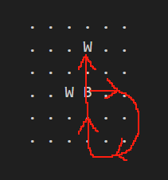

# 规则判断实现指导

> 这是一个略有难度的算法任务，本文会给出一种实现思路，同时对一些有争议的规则做出规定。

## JudgeEnd

```cpp
enum class SurakartaEndReason {
    NONE,          // not end
    STALEMATE,     // both players can't make more move
    CHECKMATE,     // one player's all pieces are captured
    TRAPPED,       // unused, one player's pieces are all trapped, no legal move can be made.
    RESIGN,        // unused, one player resigns.
    TIMEOUT,       // unused, one player's time is out.
    ILLIGAL_MOVE,  // one player makes an illegal move
};
```

### ILLEGAL_MOVE

按照一般的常识，`ILLEGAL_MOVE` 发生时无论如何也是要判输的，所以这是最优先的判断：

```cpp
if (!IsLegalMoveReason(reason)) {
    winner = ReverseColor(game_info_->current_player_);
    return std::make_pair(SurakartaEndReason::ILLIGAL_MOVE, winner);
}
```

### CHECKMATE

注释里有提到，此时棋盘的状态都还没有更新，所以一方全被吃完其实并不是没有棋子，而是恰好还剩一个棋子，且这回合是合法吃子。

### STALEMATE

计算到底多少局没有发生吃子会有点绕，思考这个问题最简单的方法就是代入一个边界，首先我们的 `num_round_` 是从 1 开始的

```cpp
SurakartaGameInfo(unsigned int max_no_capture_round = 40)
    : current_player_(SurakartaPlayer::BLACK),
      num_round_(1),
      last_captured_round_(0),
      end_reason_(SurakartaEndReason::NONE),
      winner_(SurakartaPlayer::NONE),
      max_no_capture_round_(max_no_capture_round) {}
```

我们想象规则是 1 回合没有吃就判 `STALEMATE`，如果第一回合没有吃子，那就应该判 `STALEMATE`，此时 `game_info_->num_round_ - game_info_->last_captured_round_` 刚好等于 1，所以判断条件就是


```cpp
game_info_->num_round_ - game_info_->last_captured_round_ >=
        game_info_->max_no_capture_round_
```

以及 `STALEMATE` 的最后是要按照所剩棋子的数量来判断的，包括相同时的平局。


## JudgeMove

```cpp
enum class SurakartaIllegalMoveReason {
    LEGAL,                     // unused
    LEGAL_CAPTURE_MOVE,        // capture a opponent's piece, and the move consists at least one corner loop
    LEGAL_NON_CAPTURE_MOVE,    // just as the name
    ILLIGAL,                   // unused
    NOT_PLAYER_TURN,           // unused, move when it's not the player's turn.
    OUT_OF_BOARD,              // from or to position is out of board
    NOT_PIECE,                 // move a position that is not a piece
    NOT_PLAYER_PIECE,          // move a piece that is not the player's
    ILLIGAL_CAPTURE_MOVE,      // try to capture a opponent's piece, but the move can't consist any corner loop
    ILLIGAL_NON_CAPTURE_MOVE,  // otherwise
    GAME_ALREADY_END,          // unused
    GAME_NOT_START             // unused
};
```

如果同时满足多个条件，我们按照定义的顺序输出：

所以依次是 `OUT_OF_BOARD`，`NOT_PIECE`，`NOT_PLAYER_PIECE` 这几个很容易判断的。

然后我们先区分吃子移动，和普通移动，很简单，如果终点是对方棋子，就是吃子移动，所以下一步就是判断合不合法了，普通移动很简单，只要横竖距离的差都小于1即可，重点是怎么判断吃子。

这里我们采用先预处理出所有合法的吃子，再判断当前的移动是否在其中。单独求某个移动是否合法的耗时不会比这个少多少，而且可能更为复杂。

我们提供的 `OnUpdateBoard` 函数就是为了你可以只在每次更新棋盘的时候更新一次合法吃子列表。

### LegalMoveList

我们的坐标和数组下标的对应关系是 `_board[x][y] = (x, y)`，这可能和你在编程里常见的第一维数组是竖，第二维是横不同。

```cpp
/*
                x  0 1 2 3 4 5
              y┏━━━━━━━┓ ┏━━━━━━━┓
               ┃ ┏━━━┓ ┃ ┃ ┏━━━┓ ┃
              0┃ ┃ 1 1 1 1 1 1 ┃ ┃
              1┃ ┗ 1 1 1 1 1 1 ┛ ┃
              2┗━━ 0 0 0 0 0 0 ━━┛
              3┏━━ 0 0 0 0 0 0 ━━┓
              4┃ ┏ 2 2 2 2 2 2 ┓ ┃
              5┃ ┃ 2 2 2 2 2 2 ┃ ┃
               ┃ ┗━━━┛ ┃ ┃ ┗━━━┛ ┃
               ┗━━━━━━━┛ ┗━━━━━━━┛
*/
```

吃子的本质是在一个曲折的环上走，当最先遇到的棋子是对方时，可以吃掉，而且至少要经过一次外棋线。

```cpp
/*
                x  0 1 2 3 4 5
              y┏━━━━━━━┓ ┏━━━━━━━┓
               ┃       ┃ ┃       ┃
              0┃       ┃ ┃       ┃
              1┃       ┃ ┃       ┃
              2┗━━━━━━━┃━┃━━━━━━━┛
              3┏━━━━━━━┃━┃━━━━━━━┓
              4┃       ┃ ┃       ┃
              5┃       ┃ ┃       ┃
               ┃       ┃ ┃       ┃
               ┗━━━━━━━┛ ┗━━━━━━━┛
*/
```

一个争议是例如下面的路线是否合法：



在这次大作业的过程中，我们认为是合法的：笔者也没有找到特别正式的规则说明，网上大多数也是自己理解的实现，这里我们统一采用比较符合直觉的，也就是如果你在现实中拿着棋子移动，你显然不会自己把自己挡住。

#### 具体实现

这里给出一种实现思路，以 6 路棋盘为例。

1. 首先，我们需要提取出这两个环上的所有棋子，顺序排列，这两个环的处理方式相同，我们以上图这个环为例
    - 注意：如果交点上存在棋子，它应该被提出来两次
    - 比较笨的方法是手写两个大数组，把整个环上的点的坐标按顺序写下来，然后遍历手写的大数组去取
    - 另一种办法就是从某个起点开始，往一个方向走（以下假设是顺时针），走到头就沿着最近的角点顺时针旋转 270 度，然后移动方向也旋转 270 度，直到回到起点，这其中涉及到简单的坐标计算
2. 吃子总是发生在某两条跨越了外棋线的直线之间，所以我们可以按照直线分组：比如我们按照顺时针，规定这四条直线的顺序是 y = 2，x = 2，y = 3，x = 3，他们分别记作 `lines[0...3]`。
3. 那么吃子就发生在相邻的两个 `line` 之间。这里遇到第一个细节，相邻应该是指中间没有其他棋子的两条直线之间，假如 `lines[1]` 上没有棋子，那么 `lines[0]` 和 `lines[2]` 就是相邻的。
4. 下一步，我们处理出所有的相邻的直线，以下是一种实现方法：

    ```cpp
    for (int i = 0; i < 4; i++) {
        if (lines[i].empty()) {
            continue;
        }
        int j = (i + 1) % 4;
        while (lines[j].empty()) {  // at least go back to i
            j = (j + 1) % 4;
        }
        // lines[i] and lines[j]
    }
    ```

    这可能会有重复，比如只有两条线时 `i, j` 和 `j, i`，是否去重并不是很重要的问题（也就是变成组合），或者另一个极端，总是重复（变成排列），以下按照组合描述（也就是假设 i j 和 j i 不会都出现）。

    以下我们假设这两条相邻的线是 P 和 Q。
5. 到了这里，问题已经呼之欲出了，在不考虑交点上存在棋子时，每个棋子都是唯一的，可以吃的条件就是
    - P 的最后一个棋子和 Q 的第一个棋子是异色棋子。
    - 当然，只有当前回合的棋子能吃，所以方向是其中之一。
    
    但考虑交点上存在棋子时，就会遇到上面提到的争议问题，这里我们表示成 `... A Rotate A B ...`，也就是 A 是 P 的最后一个，又是 Q 的第一个时，当 A 经过一个旋转后，其实并不会被自己所阻拦，所以我们的判断条件是

    - P 的最后一个棋子 A 和 Q 的第一个棋子是同一个棋子
    - A 和 Q 的第二个棋子（如果存在）B 是异色棋子
    - A 是当前回合的棋子
    - （显然 B 是不能吃回去 A 的，所以这里并不像上面是双向的）

    类似地，你还会遇到 `... A B Rotate B ...` 这种情况，这里我们不再赘述。

    所以一共是三种情况（如果第一种算两个方向的话，就是四种）

    注意第二种和第三种情况可能共存，例子就是争议问题的配图，可以表示成 `... A B Rotate B C ...`。


#### 其他细节

我建议不要修改 TODO 之外的内容，比如如果你要存储合法吃子列表，就在 `SurakartaRuleManager` 里存。我们会覆盖 tests 后测试，所以也不要修改 tests 下的文件。

## 关于大作业

大作业的主要目的不是为难大家，我们鼓励提前上传作业报告到 Github 的主仓库下供别人研究，我们允许借鉴别的组的思路（但你最好标注，同时这当然不包括抄代码），大作业的主要目的是多写代码，多学写代码。评分主要是编程风格上的，不希望有人完不成。

因为目前没有收到任何小组的报告，故上传本文档。
